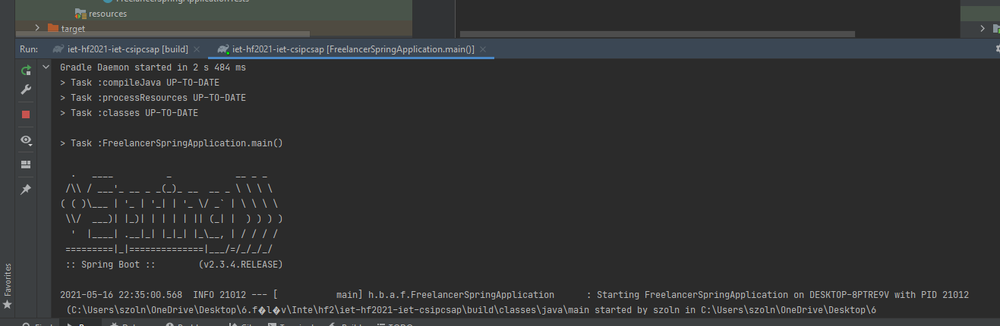
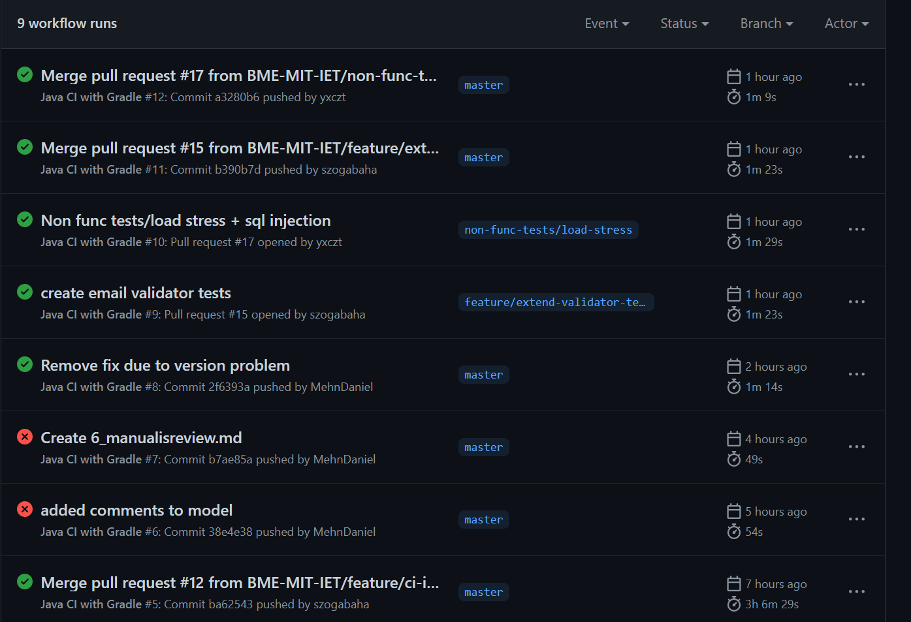

# Gradle build framework beüzemelése

Az eredeti projektben maven-t használtunk build keretrendszerként. Első gyűlésen megbeszéltük, hogy érdemes lehet kipróbálni ugyanezt gradle-lel, mivel gazdagabb környezetet tud nyújtani.

## Beüzemelés
A beüzemeléshez találtunk lehetőséget arra, hogy korábbi maven projektet konvertáljunk át gradle alapú projektre. A megvalósítás során emellett maradtunk, viszont az átkonvertálás közben egész sok olyan probléma keletkezett, amelyek megoldása nagyon sok időt vett el. Így utólag valószínüleg azt mondanám, hogy jobban megérte volna 0-ról beírni a dependency-ket és a működést. A beüzemelést követően eltávolítottuk a projektből a korábbi maven-hez köthető fájlokat. 

## Problémák
* Az átfordulás után keletkeztek olyan dependency konfliktusok, amiket nem tudott magától feloldani a gradle. Ilyen volt pl. hogy az 1.18.16-os verziójú lombok tartalmazott olyan hibát, ami maven környezetben nem volt probléma, gradle környezetben egy másik library-nál viszont problémát jelentett. 1.18.20-ban már megoldották ezt a problémát.

* Nagyon sok idő elment arra, hogy a JDK verzióját be lehessen állítani a projekt default-jára. A saját környezetemben 16-os JDK van telepítve, ami alapból eltörte a kódot. Ezek után a gradle okozott problémát, mivel a JVM és JDK beállítása se egyezett meg a projekt default verziójával. 

* A teszt nem működött rendesen, mivel a tesztek elérési helye nem egyezett meg a gradle által beállított default path-el. Ennek megoldása után a tesztesetek is le tudtak futni.

* A lombok-hoz tartozó annotation processor nem generálódott ki rendesen a projekt átkonvertálásakor. Ezt utólag kellett pótolni.

* voltak olyan dependenciák, amelyek compileOnly-ként lettek behúzva, viszont szükség volt implementation-ra is.

Ezen próblémák megoldása után sikerült a gradle-t használni futtatásra és tesztelésre is. Alább látható egy kép arról, ahogy a gradle-t használva futtatjuk az alkalmazást:

# Github Actions workflow beüzemelése
A gradle beüzemelése után ennek láttam neki, itt igazából a legtöbb időt az alkalmazás áttekintése és megismerése jelentette. Mivel az utolsó pillanatra hagytuk, több időt kellett várni, míg queue-ban volt egy action. Eleinte azt hittem, hogy ez hiba, viszont később ránéztem más projektekre és kiderült, hogy mindenkinél kb ilyen hosszú a queue time. 
Az actions-t az init verziótól annyiban változtattuk meg hogy a teszteket futtattja le. Próbálkoztam azzal is, hogy onPush ne, csak onMerge fusson le az action és azzal is, hogy csak bizonyos branch-eken. Ezeket végül azonban visszaállítottam a default-ra, hogy minden változás látható legyen. 

Mint utólag kiderült, erre szükség is volt, hiszen volt egy olyan változtatás, ami eltörte a kódot. Ezt a létrehozott action-nel tudtuk kiszűrni.

