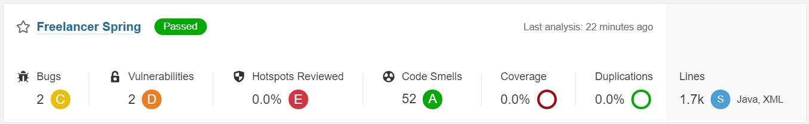
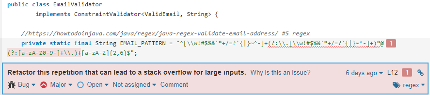
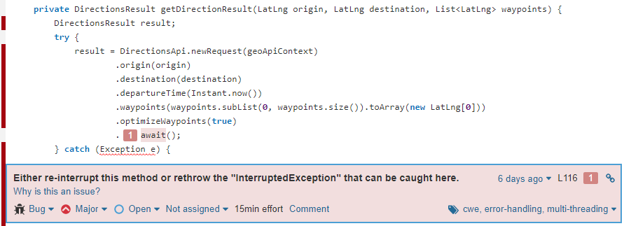
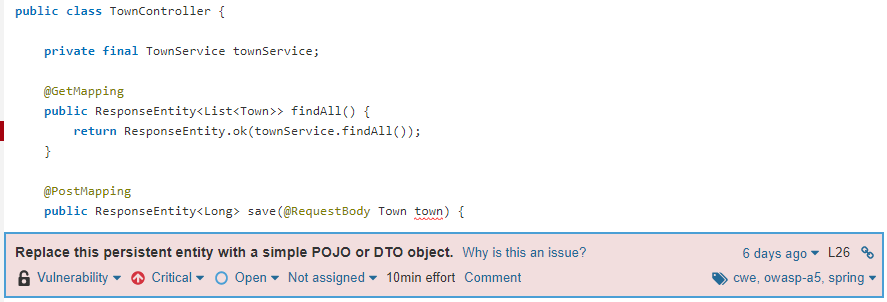
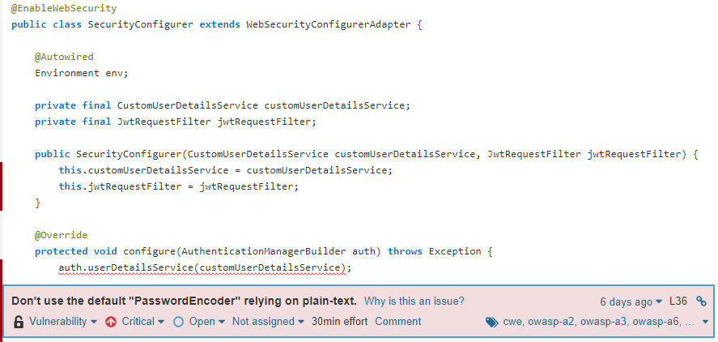
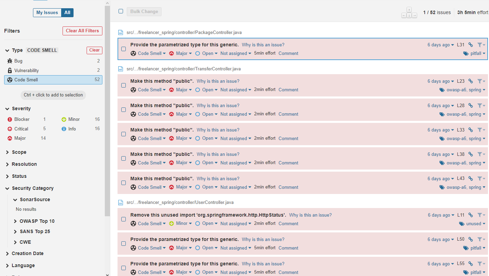
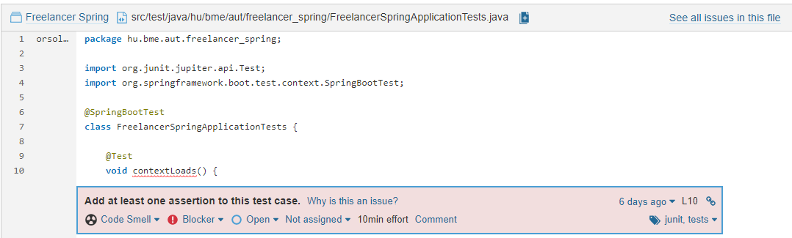
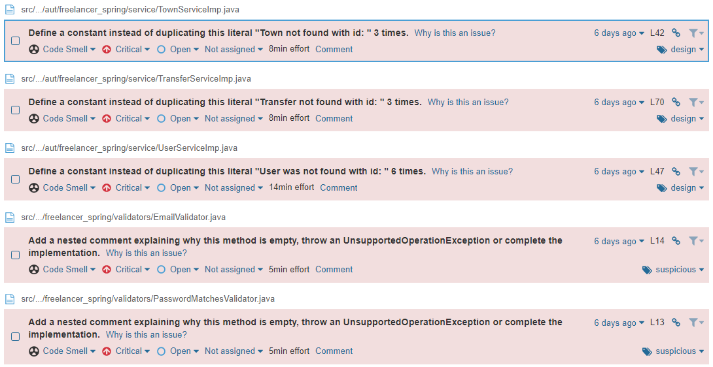
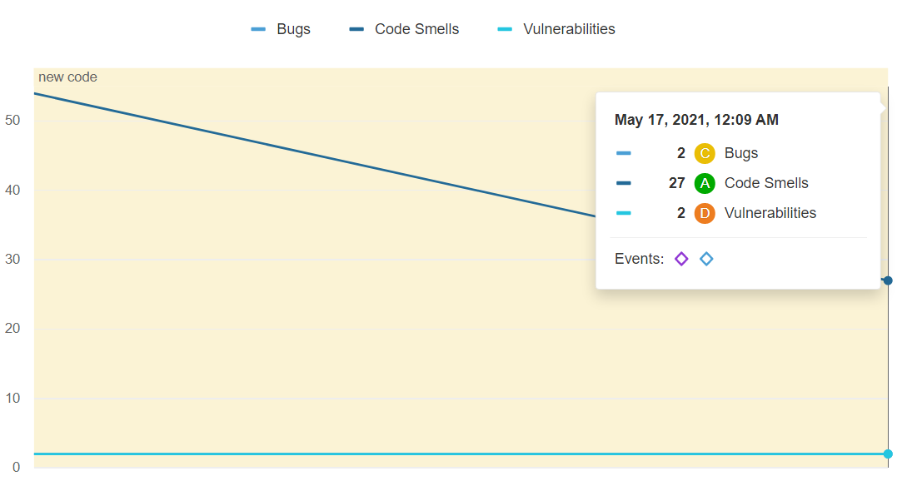

# Statikus analízis eszköz futtatása

## Feladat
A SonarQube szoftver telepítése és a szerver indítása után a már meglévő Maven builddel futtattam az analízist.
Az első futtatások után az analízis build failure miatt nem sikerült.
Az adatbáziselérés módosítása után az analízis lefutott a következő eredményekkel:

2 *major* szintű bug

2 *critical* szintű sebezhetőség

52 code smell

Ezek közül a súlyosabbak:

1 darab *blocker* szintű

5 darab *critical* szintű

A Gradle bevezetése és a kapott hibák egy részének kijavítása után a következő eredmények születtek:

## Eredmények, tanulságok

A kódminőségen sikerült javítanom. Azt a következtetést vontam le, hogy bármely projekt esetén érdemes néhány alkalommal statikus analízist futtatnunk. Ezen a példán is kiderült, hogy a program olyan potenciális hibákat is felderíthet, amelyek nem szembeötlőek, de egy éles rendszernél komoly problémákat okozhatnak.