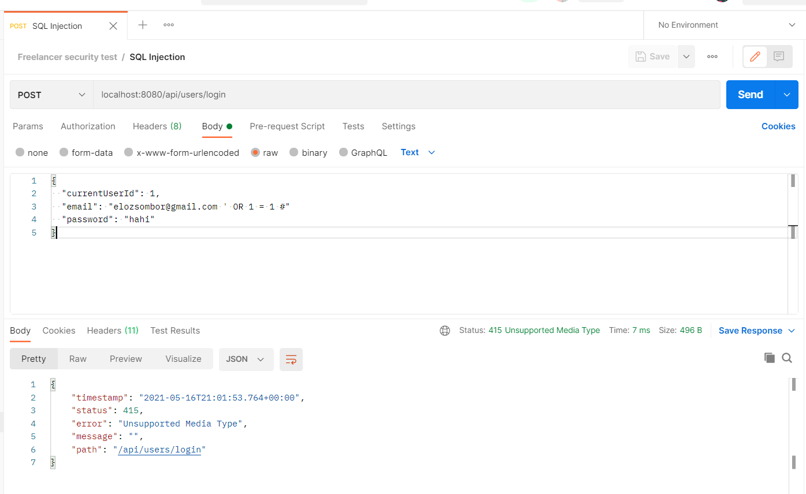

# Nem-funkcionális jellemzők vizsgálata

## Feladat
- Teljesítmény (load) teszt
- Stressz (stress) teszt
- SQL Injection (hogy legyen egy kis security is) teszt

### Felhasznált alkalmazások:
- JMeter
- Postman
- (IntelliJ IDEA, hogy valahol fusson a Rest API)

A teszteket lokálisan futtattam, 2 okból: 
- Mert élesben az ilyen teszteket nem akarunk feltétlen minden commit / push után futtatni, inkább időszakosan (mondjuk hetente / havonta). Feleslegesen nem terheljük le a szervert azzal, hogy mondjuk kitisztítottuk a comment-eket.
- Nem volt remote szerver ezért a gépemet használtam annak.

Load test : 1000 user egyidejűleg kér le adatokat, egymás után 15-ször szimulálva. A tesztek elvégzéséhez először Postman-ben futtattam néhány request-et, hogy legyen adat a teszthez. Ugyancsak Postman-ben lett megtervezve.
Stress test : 10000 user egyidejűleg kér le adatokat, egymás után 15-ször szimulálva. A tesztek elvégzéséhez először Postman-ben futtattam néhány request-et, hogy legyen adat a teszthez. Ugyancsak Postman-ben lett megtervezve.
SQL Injection : Postman-ben, manuálisan próbálkozva, githubon talált módszerekkel (https://github.com/danTaler/detectionString/blob/master/SQL-Injection). Ezek közül egyet ide is beraktam, de egyébként sehogy sem sikerült átverni az API-t.

A tesztek a github repository, non_func_tests mappájában megtalálhatóak, a megfelelő előkészületekkel újraszimulálhatóak. Ami nincs ott, az a Postman workspace, ez meg van osztva néhány csapattársammal.

_Képernyőkép load test 1_

_Képernyőkép load test 2_

_Képernyőkép load test 3_

_Képernyőkép stress test 1_

_Képernyőkép stress test 2_

_Képernyőkép stress test 3_

_Képernyőkép SQL injection_

## Eredmények, tanulságok

Ha az ember a saját gépét használja szervernek, az valószínűleg igencsak gyenge lesz, nem véletlenül léteznek erre a feladatra dedikált szerverek. Az alkalmazás 1000 emberrel még nagyjából elbír (az összes error azért van, mert meghatároztam egy max. 500 ms-os válaszidőt), de ennek 10-szerese (ami még mindig nem hangzik olyan soknak), már teljesen romba dönti az otthoni számítógépet, sokszor azért nem szolgál ki, mert nincs rá kapacitása. Ez egy stressz helyzetben könnyen előjöhet, erre is számítani kell a tervezéskor. Az SQL Injection nagyon helyesen nem sikerült, ezt is várjuk el.