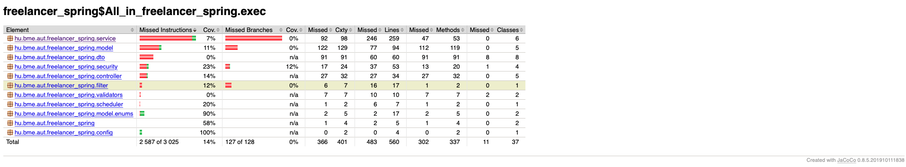
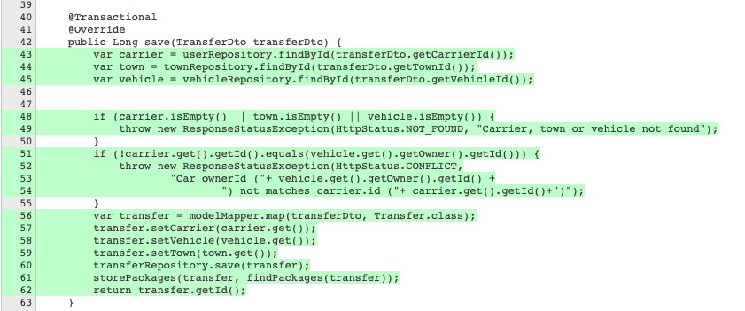
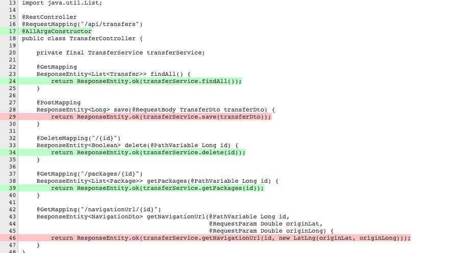
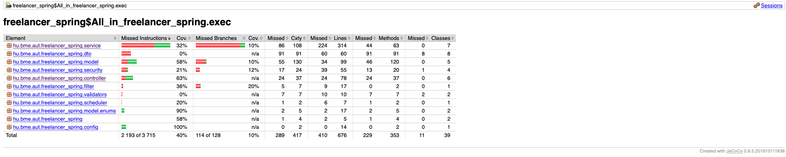

# Tesztelés JUnit 5 és Mockito eszközökkel

Az eredeti projektben nem voltak unit vagy integrációs tesztek. Ezt úgy is megnézhetjük, hogy ha megnézzük a teszt lefedettséget.

A lefedettség számításához és HTML reprezentációjának generálásához a JaCoCo eszközt használtam, ami az Intellij IDEA-ba be van építve.

Ahhoz, hogy javítjuk ezeken az eredményeken a TransferService-re egységteszteket, a TransferController-re pedig integrációs teszteket készítettem.

Ezekben az úgynevezett AAA mintát követtem, ami segít a teszt függvényeket 3 részre osztani: arrange, act, assert.

## Unit tesztek

Ezek az egyes metódusok vizsgálatára szolgálnak a service-ben.

Egy bonyolultabb művelete a save(), mert sok függősége van, amiket ki kell mockolni. Emellett 3 ágra tud ráfutni a kód:
 * Exception, mert nem találja valamelyik erőforrást
 * Exception, mert amiket talál konfliktusban vannak
 * Sikeresen lefut

Ezeket különböző teszt függvényekben vizsgáltam meg.

A függvény tesztfedettségét vizsgálva látjuk, hogy minden sort érintettünk.

## Integrációs tesztek

Az integrációs tesztek teljes modulok egészének tesztelésére szolgálnak, mint például egy controller, ami a felső belépési pontja.

Ezekben a tesztekben az egész alkalmazás build-elődik.

A HTTP kérések mockolásához a rest-assured könyvtárat használtam.

A TransferController lefedettsége:

## Eredmények

Ahogy látjuk, jobb már a lefedettség az összkódban.

